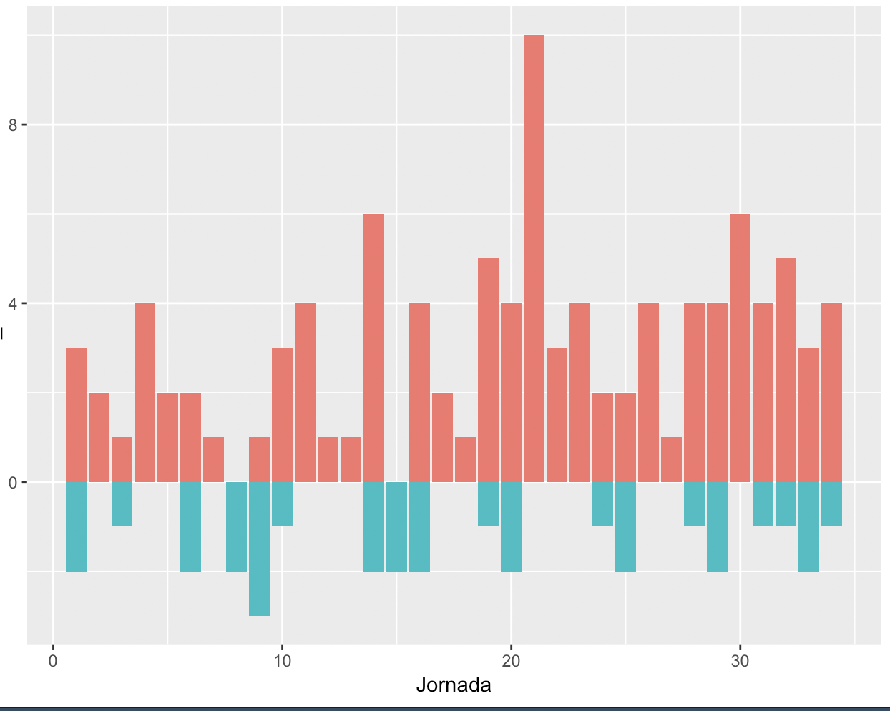
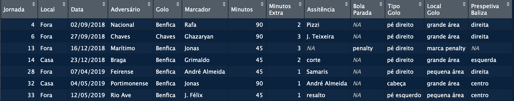
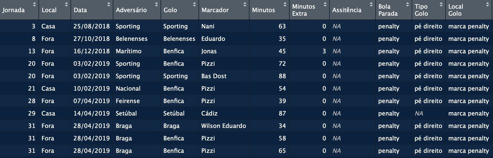
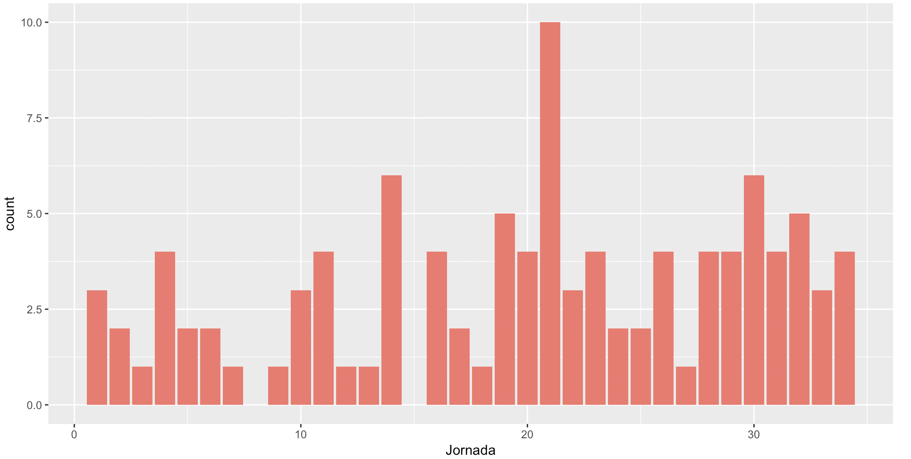
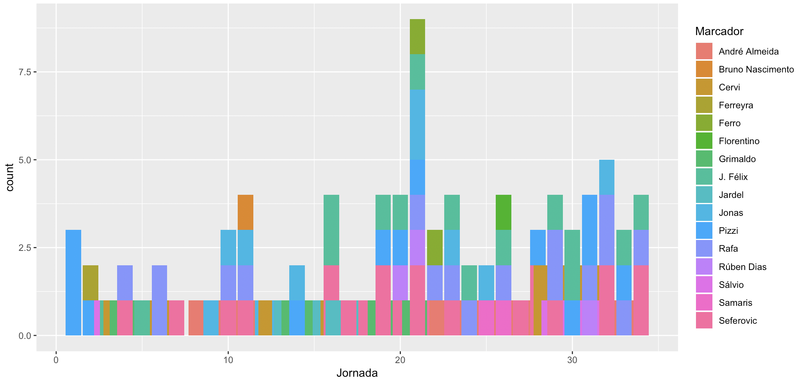
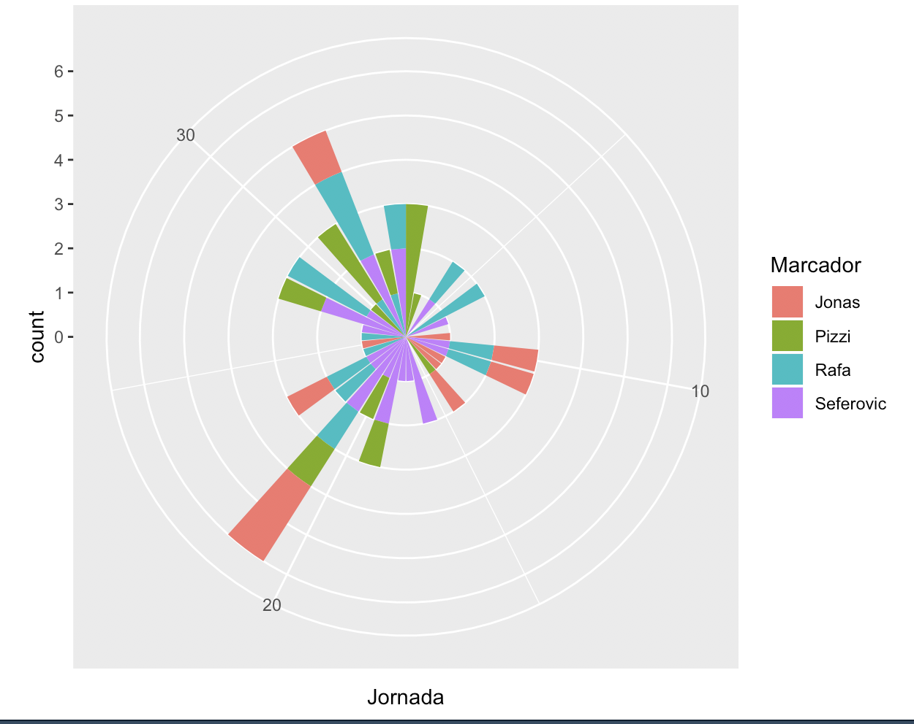
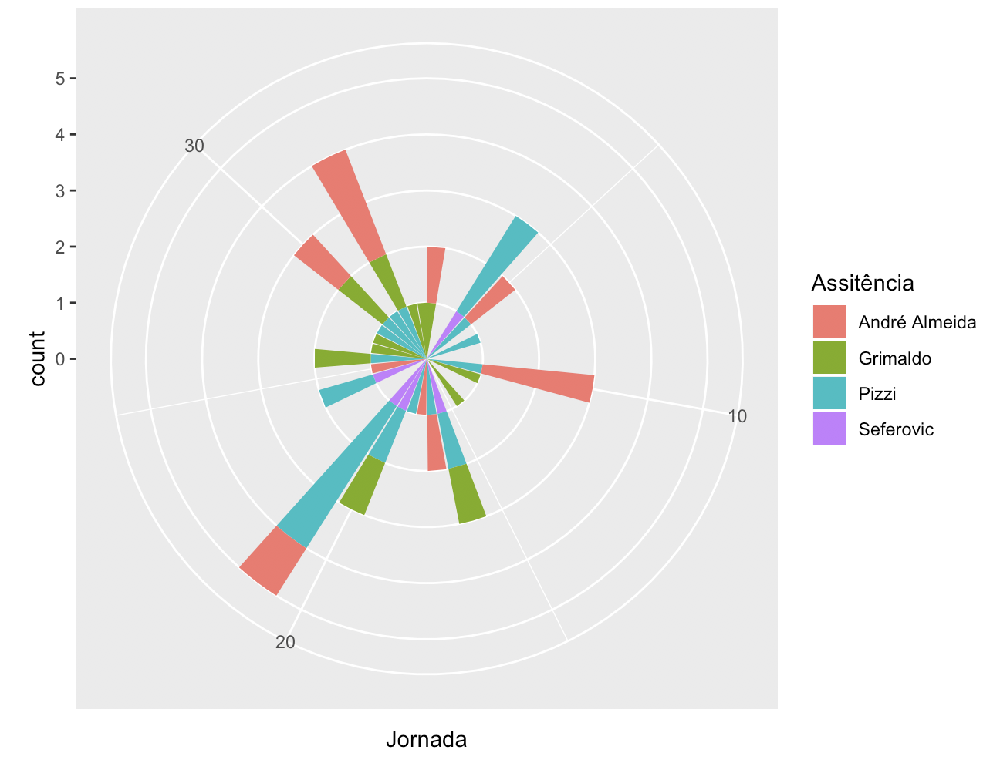
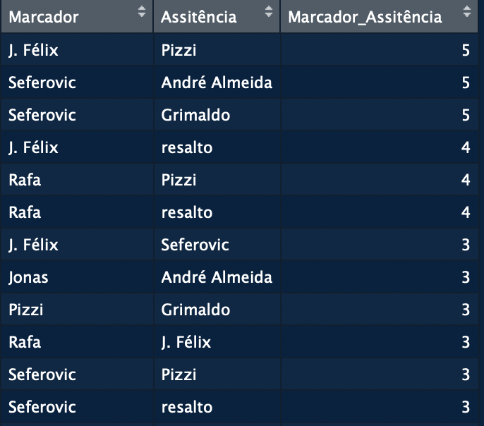
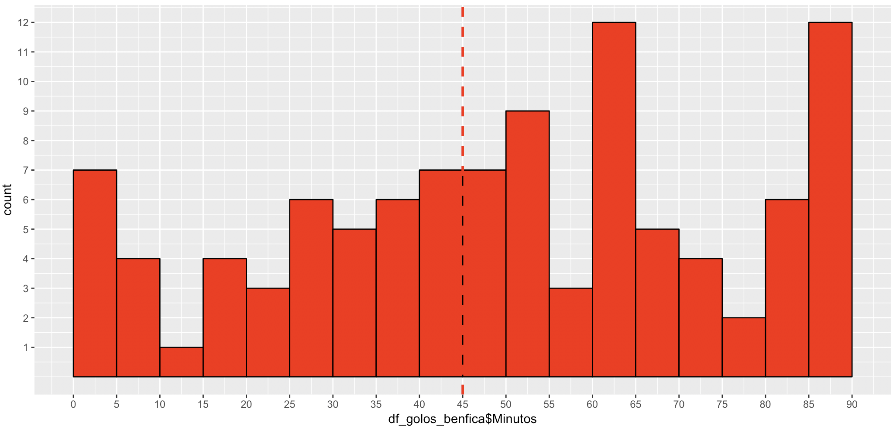

# A história da Resconqusta em números

## Introducão 

A partur de um simplesdataframe de 143x13 que incluí os detalhes mais relevantes dos golos marcados e sofridos pelo Benfica na época 2018/19.

## Dados Gerais

### Golos

 * 34 jornadas

 * 134 golos

 * 80 golos em casa, 54 fora

### Equipas que não marcaram ao Benfica

Nacional, Aves, Tondela, Marítimo

### Comparação de golos por jornada (Benfica vs Adversário)

### Golos em tempo extra

### Penaltis

### Tipo de golo

* Cabeça: 22

* Pé direito: 73

* Pé esquerdo: 38

### Local do golo 

* Fora da área: 12
* Grande área: 90
* Penalty: 11
* Pequena área: 21

### Golo do ponto de vista da baliza

* Esquerda: 27
* Direita: 25
* Centro: 71

## Só Benfica

### Golos por jornada

### Golos por jogador

### Melhores marcadores

Primeiros golos por jogo no centro ...

Exemplo: Seferevoic marcou, em muitos casos, o primeiro golo do Benfica num jogo.

### Mais assistências

### Melhor combinação asistência-golo

### Golos no tempo de jogo

