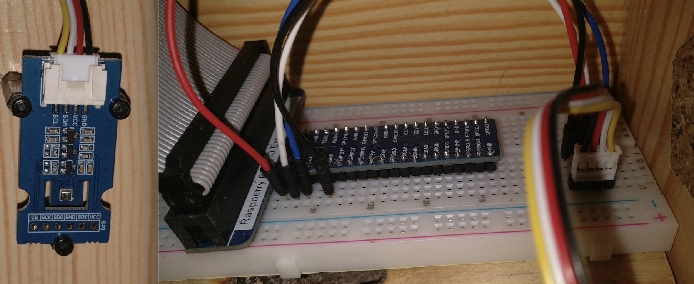
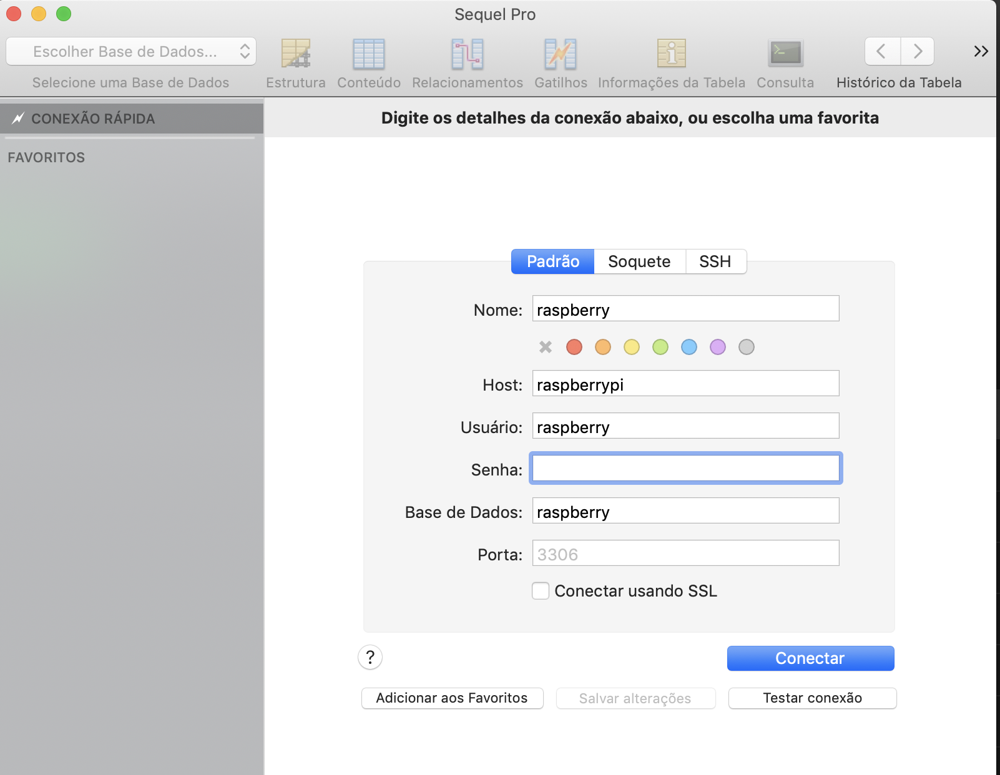
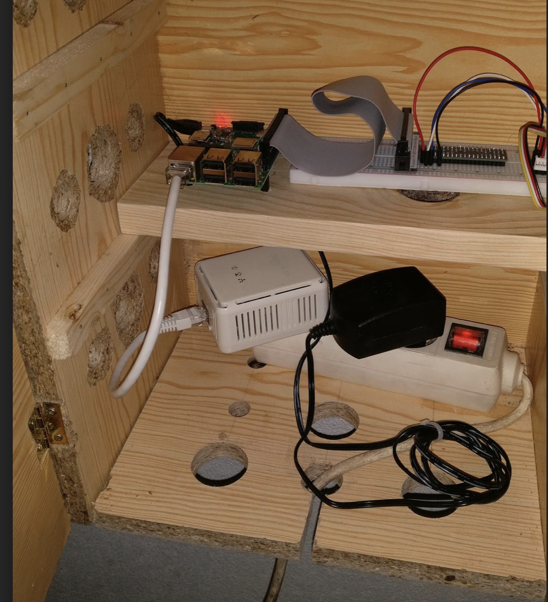
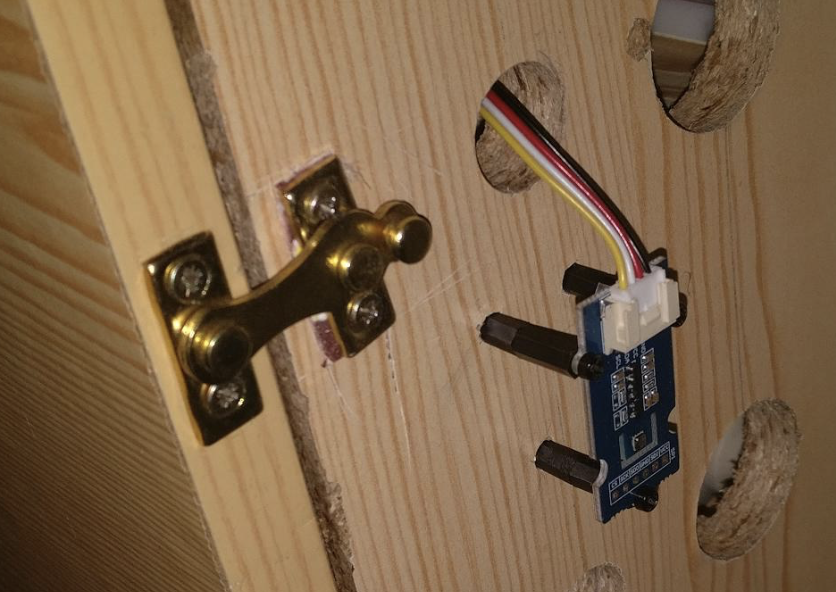
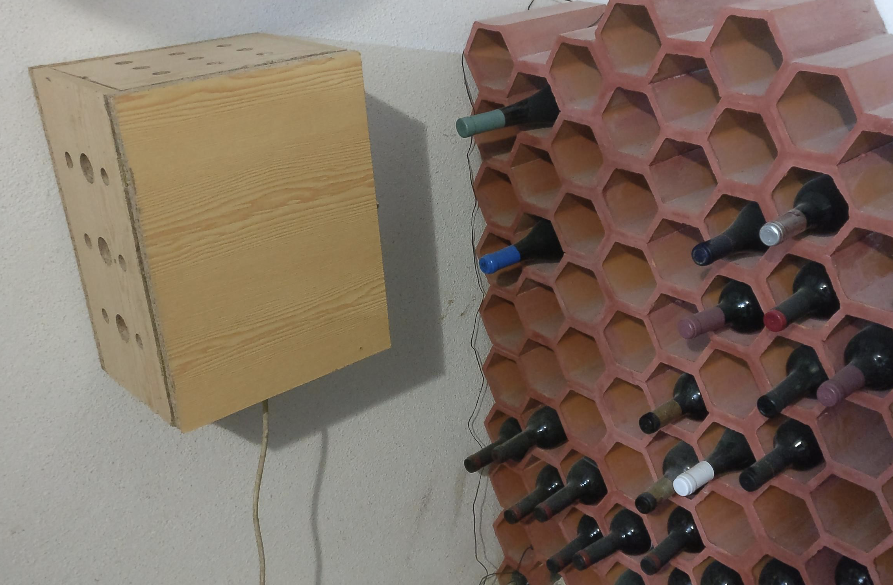
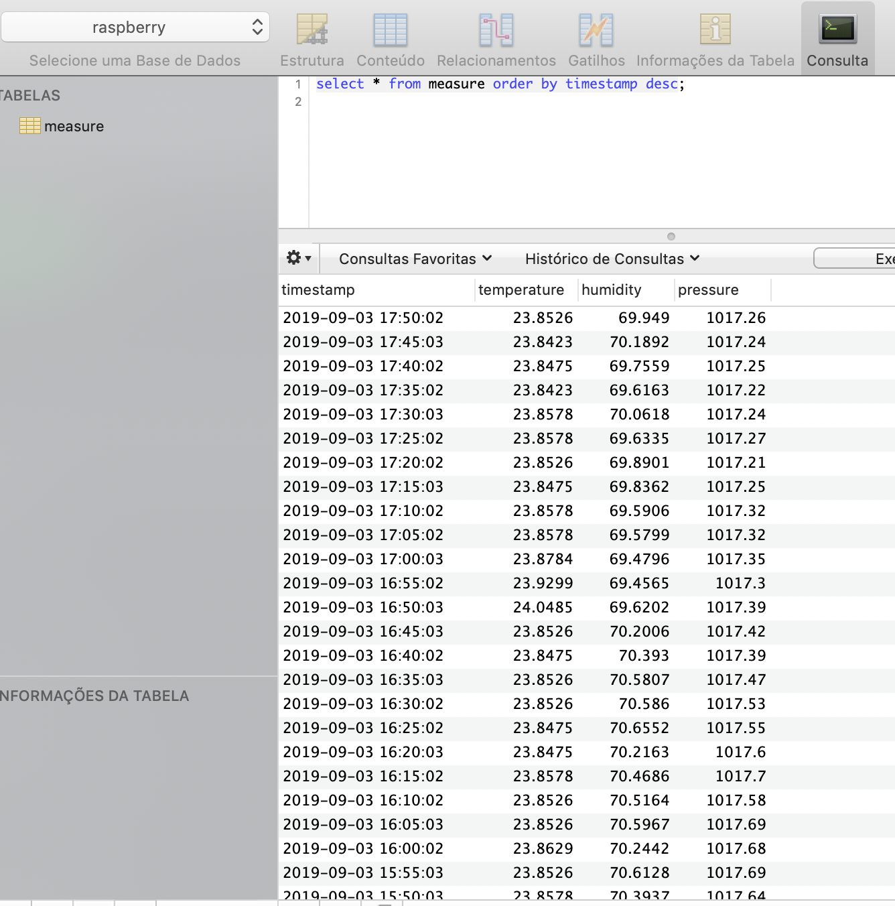

# Weather Station


## Introduction

Using a Raspberry Pi to build a basic weather station to control clima conditions in a cellar.

Data is retreived from the sensor and stored in a relational database for further processing.

## Material

* Raspbery Pi 3 B+
* Weather sensor BME 280
* Cables
* Breadboard for simple connections
* Plywood board
* Door locker
* 2 x Corner door hinge
* Wood glue
* Metal nails
* Power line devices for LAN access


## Box

 A wooden box is build with 6 panels:
 
 * 2 x **40x30 cm** for the background and door;
 * 2 x **40x20 cm** for the sides;
 * 2 x **30x20 cm** for the top and bottom. 


Cut the wood according to dimensions. Glue and nail the panels together to create the box.

Makes holes for refrigeration.

Apply the locker and the hinges to the door.

Make at least 2 shelfs to better use the box.


## Connection

Using the I2C serial interface (4 connections) with the following rules:

* Raspberry PI GPIO pin 1 (3.3 V) to BME VCC - power supply;

* Raspberry PI GPIO pin 9 (GROUND) to BME GND - ground suply;

* Raspberry PI GPIO pin 3 (I2C1 SDA) to BME SDA - data access;

* Raspberry PI GPIO pin 5 (I2C1 SCL) to BME SCL - control access.




## I2C

BME 280 weather sensor is controlled over IC2 serial interface.

Install the Raspberry PI **I2C tools** and the Python module for access.

Install tools to control ic2

```sudo apt-get install -y python-smbus i2c-tools```

Check if ic2 is enable

```lsmod | grep i2c_```

Detect devices and presents the port where the device is connected.

```i2cdetect -y 1```

Identify the address for the BME280:


In this case is **76**.


## Maria DB

Maria DB is selected as the realational database.


### Install ###

```sudo apt-get install mariadb-server```

### Setup ####

Run the DB hardening where root password may be changed.

```sudo mysql_secure_installation```

Access DB

```Sudo mysql -u root -p```

Create User, DB and grant previledges


``` sql
CREATE USER raspberry IDENTIFIED BY '<password>';
CREATE DATABASE raspberry;
grant all privileges on raspberry.* TO 'raspberry'@'%' WITH GRANT OPTION;
flush privileges;
show DATABASES;
SHOW GRANTS FOR raspberry;
```

### Allow remote access

Go to:

```cd /etc/mysql/mariadb.conf.d```

Edit file:

```50-server.cnf```

comment line:

```bind-address           = 127.0.0.1```

Restart th DB.


### Managenent ###

Stop

```sudo systemctl stop mariadb.service```

Restart

```sudo systemctl restart mariadb.service``` 

Disable at boot time

```sudo systemctl disable mariadb.service```

Check Status

```sudo systemctl is-active mariadb.service``` 


### Connecting to Maria DB ###

By using my sql client at raspberry pi:

```mysql --user=raspberry --password=<password> raspberry```

From MAC OS cli access is avaialbe with **mycli**.

Install it with brew:

```Brew install mycli```

Connect with:

cmycli -h raspberrypi -u raspberry -p pwd raspberry```


A graphical alternative is [Sequel Pro](https://www.sequelpro.com):




### Table in Maria DB


``` sql
Drop table ‘measure’;

CREATE TABLE `measure` (
  `timestamp` datetime DEFAULT NULL,
  `temperature` float DEFAULT NULL,
  `humidity` float DEFAULT NULL,
  `pressure` float DEFAULT NULL
  
) ENGINE=InnoDB DEFAULT CHARSET=utf8mb4;

SELECT * FROM MEASURE ORDER BY timestamp desc;

```

## Code

### Install Maria DB lib for Python

```sudo pip3 install pymysql```


### Execution Script

The execution script is available in Python with name ```weather.py```.

It uses the following Python libraries:

* smbus2 - for I2C serial bus access to BME280;
* bme280 - data transfer to BME280 weather sensor;
* pymsql - python driver for Maria DB.

The script runs, gathers data and writes into Maria DB in table **measure**.

Add **cron tab** for periodically execution:

```*/5 * * * * /usr/bin/python3 /home/pi/Python/weather.py```

	
## Mount

Within the box:



BME280 sensor application:



Final mount:



Resulting data:




## Monitoring

Check disk space and temperature with Python script **monitor.py**.

As no ventilation is being used in the box, special care about CPU temperature must be taken.

The script uses library **psutil**:

```sudo pip3 install psutil```

## Monitor with a web server

For easier access use a web server, a simple one is lighthttpd. Install with:

```sudo apt install lighttpd```

Management commands:

```
sudo service lighttpd force-reload
sudo /etc/init.d/lighttpd stop
sudo /etc/init.d/lighttpd start
sudo /etc/init.d/lighttpd status
sudo nano /etc/lighttpd/lighttpd.conf
```

Deployment dir is available in:

```/var/www/html```

Add a directory like **weather** and the access link is:

[http://raspberrypi/weather](http://raspberrypi/weather)

A script called **weather_web.py** builds a file called **index.html** into the web server deployment dir ```/var/www/html/weather```.

Extend the **cron tab** to generate the page:

```*/5 * * * * /usr/bin/python3 /home/pi/Python/weather.py;/usr/bin/python3 /home/pi/Python/weather_web.py```

More details on lightttpd configuration for raspberrypi in  [here] (https://alirumane.github.io/2016/04/10/setting-lighttpd-on-raspberry-pi).


## ntp

It is advisible to activate NTP in order to have time/date synchronized automatically.

Activate NTP:

```sudo timedatectl set-ntp True```

Check status:

```timedatectl status```